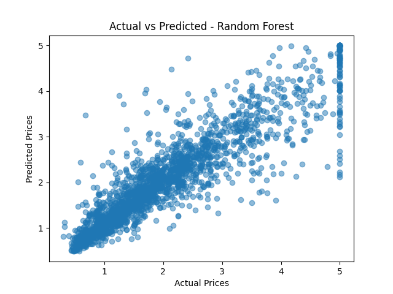

# House Price Prediction - Regression Project

A simple machine learning project using the California Housing Dataset to predict house prices.

## Models Used:
- Linear Regression
- Decision Tree Regressor
- Random Forest Regressor
- Support Vector Regression (SVR)

## Technologies:
- Python
- Pandas, NumPy
- Matplotlib
- Scikit-learn

## Evaluation Metric:
- Mean Squared Error (MSE)

## Results:
| Model | MSE |
|-------|-----|
| Linear Regression | ~0.56 |
| Decision Tree | ~0.47 |
| Random Forest | ~0.25 |
| SVR | ~0.36 |

*Random Forest gave the best performance.*

## Visualization:

The following plot shows the predicted vs actual house prices using Random Forest:

